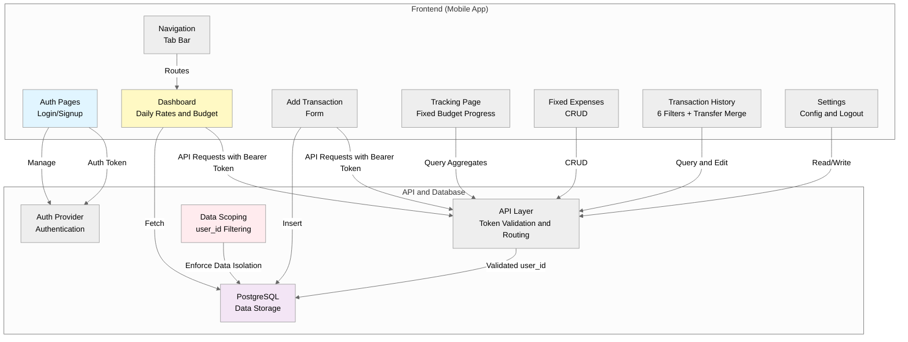
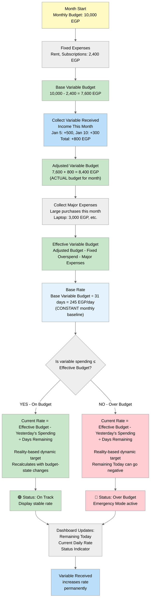
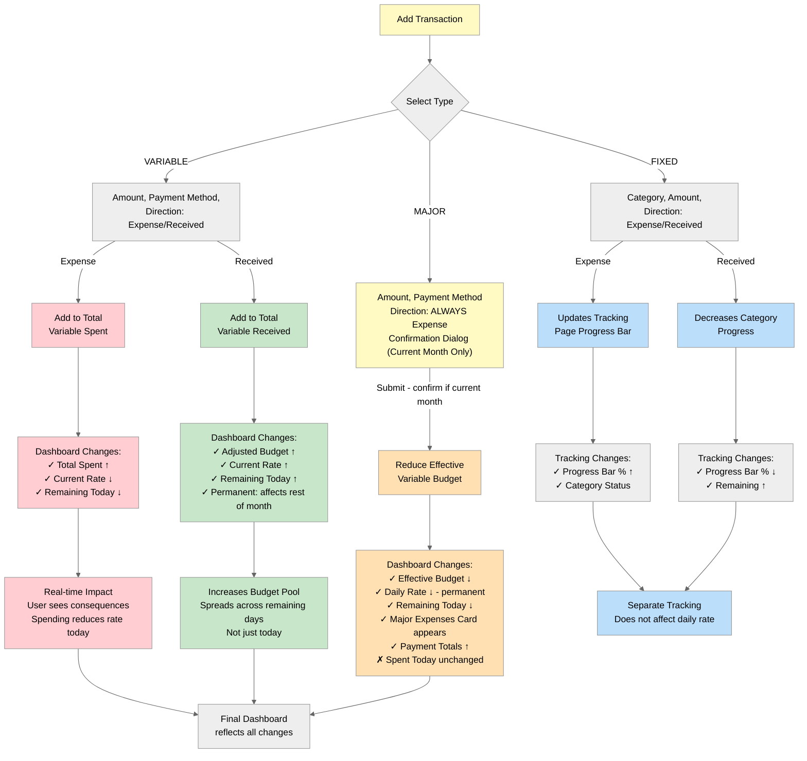
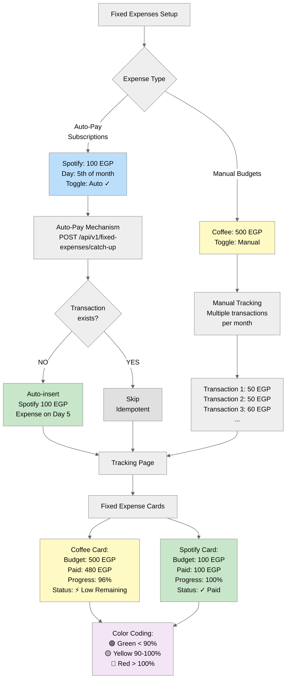
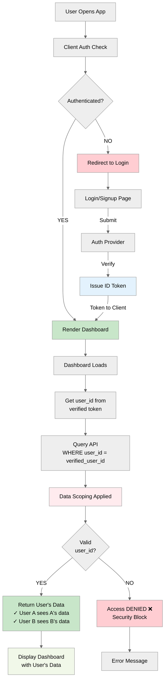
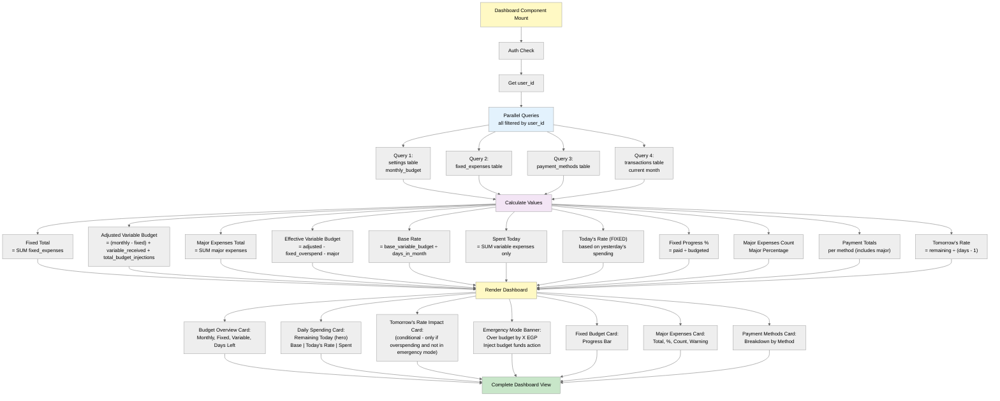
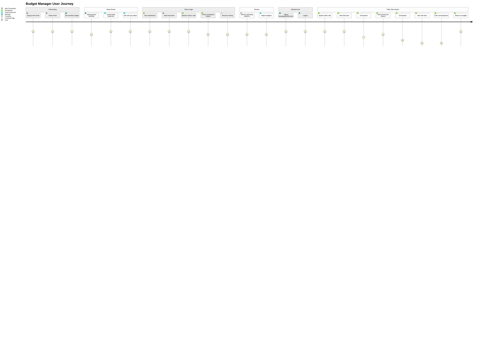
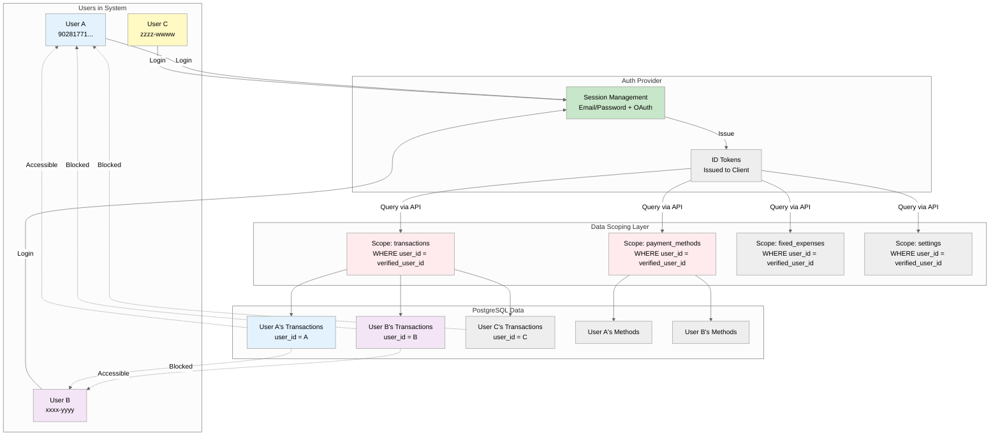
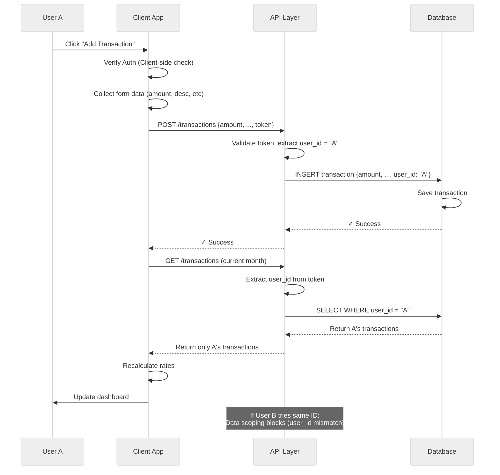

# Stashy — Mermaid Diagrams

## Diagram 1: System Architecture Overview

---

## Diagram 2: Daily Rate Calculation Logic

---

## Diagram 3: Transaction Flow & Impact

---

## Diagram 4: Fixed Expense Dual Tracking

---

## Diagram 5: Authentication & Data Isolation

---

## Diagram 6: Dashboard Data Flow

---

## Diagram 8: Complete User Journey

---

## Diagram 9: Data Security & Isolation

---

## Diagram 10: Request Lifecycle with Data Scoping

---

**How to Use These Diagrams:**

1. **Copy the entire mermaid code block** (between triple backticks)
2. **Paste into one of these viewers:**
   - [Mermaid Live Editor](https://mermaid.live) - Best for editing & exporting
   - [GitHub markdown](https://docs.github.com/en/get-started/writing-on-github/working-with-advanced-formatting/creating-diagrams) - Works in README.md
   - [Notion](https://www.notion.so) - Supports Mermaid natively
   - Your documentation tool (Confluence, GitBook, etc.)

3. **Export as:**
   - PNG/SVG image
   - PDF document
   - Embedded in markdown

**Recommended diagram order for presentation:**

1. System Architecture (Diagram 1) - "Here's how the system works"
2. Daily Rate Logic (Diagram 2) - "Core calculation engine"
3. Transaction Flow (Diagram 3) - "What happens when users spend"
4. Authentication (Diagram 5) - "How we protect data"
5. Data Security (Diagram 9) - "Why User A can't see User B's data"
6. Complete Journey (Diagram 8) - "User experience flow"
